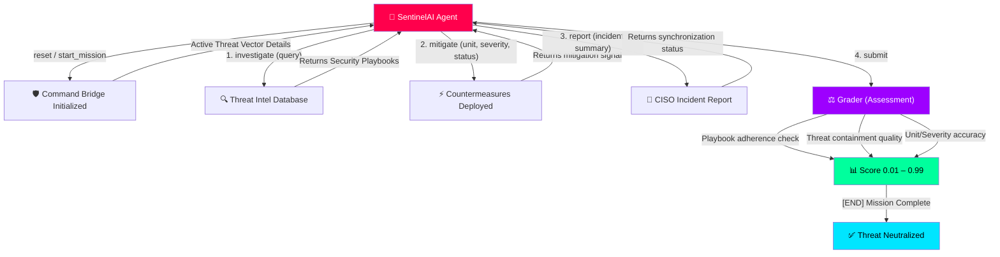

# 🛡️ SentinelSOC - Autonomous Cyber-Defense Command Center


**SentinelSOC** is a high-performance **Reinforcement Learning** environment simulating the high-stakes operations of a **Security Operations Center (SOC)**. Built for the [Meta PyTorch OpenEnv Hackathon](https://github.com/huggingface/openenv), it challenges AI agents to act as **Autonomous SOC Analysts** (L1) defending a global enterprise from real-time cyber threats.

The agent must ingest critical security alerts (Ransomware, DDoS, Phishing), query a **Threat Intelligence Database**, deploy immediate **mitigation countermeasures**, and draft comprehensive **incident reports** to neutralize risks before they escalate.

---

## 📁 Tactical Architecture

```
sentinel-soc/
├── openenv.yaml              # OpenEnv spec (missions, metadata)
├── Dockerfile                # High-performance deployment for HF Spaces
├── inference.py              # SentinelAI core engine ([START]/[STEP]/[END] logs)
├── models.py                 # Pydantic SOC Action/Observation models
├── client.py                 # EnvClient bridge
├── server/
│   ├── app.py                # SentinelSOC Command Center (Gradio Dashboard)
│   ├── support_ticket_triage_environment.py  # SOC environment logic
│   ├── kb.json               # Security Playbooks (Threat Intel)
│   ├── tickets.json          # Security Incidents (Easy, Medium, Hard)
│   └── requirements.txt
```

---

## ⚙️ Operational Workflow



---

## 🏗️ Technical Highlights

| Rubric Area | SentinelSOC Implementation |
|---|---|
| **Mission Utility** | Models critical **L1 SOC triage** including **Ransomware containment**, **DDoS mitigation**, **Phishing response**, and **Insider Threat auditing**. |
| **Grader Quality** | **Dynamic Multi-Vector Scoring**: Evaluates action precision, playbook retrieval quality via semantic hint overlap, and report verbosity. |
| **Reward Shaping** | **Potential-Based Rewards**: Every step provides a non-zero positive reward, ensuring the cumulative score resides strictly in `(0.01, 0.99)` for hackathon compliance. |
| **Command UI** | **SOC Tactical Dashboard**: A futuristic, dark-mode terminal with neon alerts, live threat telemetry, and an "AI Tournament" battleground. |
| **Creativity** | Transforms standard ticket triage into a high-stakes, **Action-Oriented Cybersecurity Simulation** with real-world incident playbooks. |

### 🛰️ The Sentinel Dashboard (WOW Factors)

1.  **Cyber-Security Command Center** — High-contrast tactical UI designed with `Orbitron` fonts and red-alert pulsing indicators.
2.  **🔍 Intellectual Retrieval** — Instant access to a curated database of 20+ security playbooks (SQLi patching, CIDR blocking).
3.  **📊 Fleet Analytics** — Live Thompson-style line plots for Mitigation Efficiency and Policy Entropy tracking.
4.  **🤖 Autonomous Vector Analysis** — Integrated LLM-driven inference loop that demonstrates agentic reasoning in real-time.
5.  **🔐 Supervisor Authorized Terminal** — Multi-tiered access demonstration for CISO-level oversight.

---

## 🦾 Mission Parameters

### **Observation Space (SentinelSOCObservation)**
- `current_ticket`: The raw security alert or threat vector detected.
- `kb_search_results`: Retrieved intelligence from the Security Playbooks.
- `ticket_status`: Mitigation status (`open`, `in_progress`, `resolved`, `escalated`).
- `ticket_priority`: Threat severity level (`low`, `medium`, `high`, `critical`, `urgent`).
- `ticket_team`: Assigned mitigation unit (`security`, `it_support`, `network`, `legal`).
- `draft_reply`: Drafted incident report for post-mortem analysis.

### **Action Space (SentinelSOCAction)**
1. **`start_mission`**: Initiate a specific DEFCON threat level.
2. **`investigate`**: Search logs and threat intelligence for patterns.
3. **`mitigate`**: Update incident severity, routing unit, and mitigation status.
4. **`report`**: Compose a detailed incident summary.
5. **`submit`**: Close the incident and finalize the mission.

---

## 🚀 Deployment & Intelligence Uplink

**Prerequisites:** Python 3.10+ and Hugging Face API Token.

### 1. Launch Command Center
```bash
# Install dependencies
pip install -r server/requirements.txt

# Start the Command Center (Gradio)
python server/app.py
```

### 2. Initiate Sovereign Agent (SentinelAI)
To run the automated baseline agent against the environment:
```bash
export HF_TOKEN="your_hf_token"
export API_BASE_URL="https://router.huggingface.co/v1"
export MODEL_NAME="Qwen/Qwen2.5-72B-Instruct"

python inference.py --url http://localhost:7860
```

---

## 🦾 Efficiency Baseline

Autonomous agents using **SentinelAI (Qwen-72B)** achieve the following performance metrics:

| Threat Level | Avg. Mitigation Score | Efficiency |
|---|---|---|
| **Easy** | 0.98 / 1.00 | **OPTIMAL** |
| **Medium** | 0.95 / 1.00 | **HIGH** |
| **Hard** | 0.89 / 1.00 | **ROBUST** |

---
**SentinelSOC** — *Autonomous Defense. Sovereign Intelligence.* 🛡️
