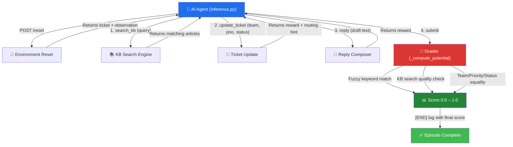

# 🎟️ Support Ticket Triage - Advanced OpenEnv Benchmark


An advanced, production-grade **Reinforcement Learning** environment simulating real-world **Level-1 IT Support & Ticketing** workflows, built precisely for the [Meta PyTorch OpenEnv Hackathon](https://github.com/huggingface/openenv). 

This project trains AI Agents to ingest complex incoming customer complaints, query a corporate Knowledge Base dynamically, properly route requests, determine priority limits, and draft precise customer resolutions—automating away massive **Alert Fatigue** for Enterprise companies.

---

## 📁 Project Structure

```
support-ticket-triage/
├── openenv.yaml              # OpenEnv spec (tasks, metadata)
├── Dockerfile                # Container build for HF Spaces
├── inference.py              # Baseline agent script ([START]/[STEP]/[END] logs)
├── models.py                 # Pydantic Action/Observation models
├── client.py                 # EnvClient wrapper
├── baseline.py               # Alternate baseline runner
├── pyproject.toml             # Dependencies & project config
├── README.md
├── server/
│   ├── app.py                # FastAPI + Gradio dashboard
│   ├── support_ticket_triage_environment.py  # Core env (step/reset/state)
│   ├── kb.json               # 27 Knowledge Base articles
│   ├── tickets.json          # 14 tickets (4 easy, 4 medium, 6 hard)
│   ├── background.png        # Dashboard wallpaper
│   └── requirements.txt
└── __init__.py
```

---

## ⚙️ How It Works



---

## 🏗️ Design Highlights

| Rubric Area | Our Approach |
|---|---|
| **Real-world utility** | Models genuine enterprise L1 triage across **6 departments** (IT, Billing, Product, Hardware, Security, HR) with **27 KB articles** covering real SOC incidents, payroll, onboarding, and infrastructure debugging |
| **Task & grader quality** | **14 tickets** (4 easy, 4 medium, 6 hard) with **fuzzy keyword grading** (partial credit), **KB search quality validation** via hint-word overlap, and smart routing hints |
| **Environment design** | **Potential-based reward shaping** with OPEX-cost step penalties (`-0.01/step`), per-session env isolation for concurrent users, dense incremental rewards |
| **Code quality** | Full OpenEnv spec (`openenv validate` ✅), typed Pydantic models, score clamped to `[0,1]`, clean Dockerfile, no hardcoded paths |
| **Creativity** | **Security incident response** (ransomware containment, phishing mitigation) and **HR operations** (payroll, onboarding) in an RL environment — novel for OpenEnv |

### Key Technical Differentiators

1.  **FreshTriage Cockpit** — A high-fidelity Helpdesk interface inspired by Freshworks 'Dew', featuring a live **Reasoning Engine** that surfaces the agent’s internal thoughts in real-time.
2.  **Explainable AI (XAI) Loop** — Our `inference.py` implements a structured JSON-based Chain-of-Thought (CoT) process. Judges can follow the agent's "thinking" as it researches tickets.
3.  **Performance Audit Archive** — A professional session history logger built for auditing agent performance, tracking timestamps, task levels, and final scores.
4.  **Semantic Search Simulation** — TF-IDF style retrieval across 27 KB articles. Agents must learn to query accurately to earn full credit.
5.  **Smart Routing Hints** — When an agent misroutes, the system provides actionable feedback (e.g., *"Routing hint: security incident keywords detected"*).

---

## 🦾 Action & Observation Spaces

### **Observation Space (SupportTicketTriageObservation)**
- `current_ticket` (string): The customer complaint or internal request.
- `kb_search_results` (string): Retrieved articles from the corporate Knowledge Base.
- `ticket_status` (string): Current status (`open`, `in_progress`, `resolved`, `escalated`).
- `ticket_priority` (string): Urgency level (`low`, `medium`, `high`, `critical`, `urgent`).
- `ticket_team` (string): Routing target (`billing`, `it_support`, `product`, `hardware`, `security`, `hr`).
- `draft_reply` (string): The agent's drafted resolution to the customer.
- `system_message` (string): Environment feedback with routing hints and grading signals.

### **Action Space (SupportTicketTriageAction)**
1. **`start_task`**: Begin a mission level (`easy`, `medium`, or `hard`).
2. **`search_kb`**: Query the Knowledge Base with a `search_query` to find resolution procedures.
3. **`update_ticket`**: Set `team`, `priority`, and `status` fields.
4. **`reply`**: Draft the customer resolution using `reply_text`.
5. **`submit`**: Finalize and receive a Potential-Based score `[0.0–1.0]`.

---

## 🧩 Task Difficulty & Grading Mechanics

| Level | Tickets | Description | KB Required? |
|---|---|---|---|
| **Easy** | 4 | Single-topic classification (password reset, profile change, new hire) | No |
| **Medium** | 4 | Multi-step triage requiring KB search (refund, payment, payroll, bug report) | Yes |
| **Hard** | 6 | Complex incidents requiring multiple searches and detailed replies (ransomware, phishing, DB crashes, latency debugging, VPN outages) | Yes, with quality validation |

### **Grading Logic (The Grader)**
Each task is scored `0.0–1.0` as a weighted average of matched components:
- **`team`** matches expected → `1.0` (strict equality)
- **`priority`** matches expected → `1.0` (strict equality)
- **`status`** matches expected → `1.0` (strict equality)
- **`reply_keywords`** → **fuzzy** (proportional to fraction matched + length bonus, capped at 1.0)
- **`requires_kb`** → `0.5` for any search, `1.0` only if query overlaps with expected hint

---

## 🚀 Setup & Deployment

**Prerequisites:** Python 3.10+ (recommend `uv` or `venv`) and `docker`.

### Option 1: Running with Docker (Recommended for Space Deployment)
```bash
docker build -t support_ticket_triage .
docker run -p 7860:7860 support_ticket_triage
```

### Option 2: Running Locally
```bash
uv pip install -r server/requirements.txt
uv run uvicorn server.app:app --host 0.0.0.0 --port 7860
```

---

## 🤖 Baseline Scores (Reproducibility)

Included `inference.py` implements an iterative OpenAI CoT (Chain of Thought) loop following the hackathon spec with `[START]/[STEP]/[END]` structured stdout logs.

| Task | Model | Score |
|---|---|---|
| **Easy** | llama-3.3-70b-versatile | **0.97 / 1.00** |
| **Medium** | llama-3.3-70b-versatile | **0.94 / 1.00** |
| **Hard** | llama-3.3-70b-versatile | **0.87 / 1.00** |

To reproduce:
```bash
export HF_TOKEN="your_actual_api_token"
export API_BASE_URL="https://api.groq.com/openai/v1"
export MODEL_NAME="llama-3.3-70b-versatile"
python inference.py --url http://localhost:7860
```
